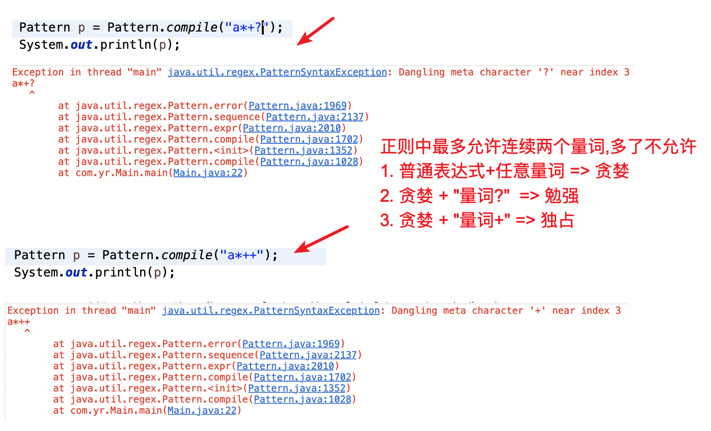
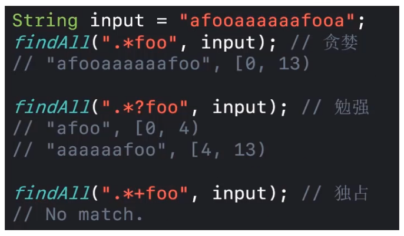
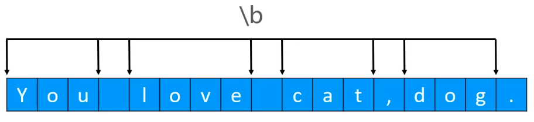

[TOC]


# 正则表达式

正则表达式在线测试:

https://c.runoob.com/front-end/854 


## 1、不同的编程语言中正则的使用 

- java 中使用正则

  ```java
  public static  void test2() { 
    // 1. 定义一个正则表达式的样式(长度为3到7个的字母)
    String reg = "[a-zA-Z]{3,7}"; 			
    // 2. 定义一个待测文本
    String text = "hello"; 	 	
    // 3. 使用正则测试文本是否合法
    System.out.println(text.matches(reg)); 	 
  }
  ```

- javaScript 中使用 正则

  ```javascript
  var reg = /[a-zA-Z]{3,7}/   		 // 定义一个3到7个字符, 2到4个数字的正则
  console.log(reg.test('abc'));    // true
  ```

  

## 2、正则表达式的语法


### 1、单字符匹配
 

> 说明:
>
> - `[ ]` 表示的是单字符匹配. [abc]表示匹配abc中一个字符, 可以等价写成`[a|b|c]` 也可以写成` (a|b|c)`, 括号表示引用组后面会介绍, 如果写成`(a|b|c)`则 `|`不能省略.`|`表示或的意思. 
>
> -  `^` 表示的是异或的意思, 取反不等于,比如: `[^a-z]` 表示匹配一个非a~z, 只要不是a~z就可以
>
> -   表示范围, 从左边到右边的意思,  `[1-4]`  表示匹配1个大于等于1小于等于4的数字
>
> - `[a-d[m-p] ]`  表示的是并集,  等价与 `[a-dm-p]` ,
>
>   比如 :  `[1-3[6-8]]` , 我们可以这样来理解:  `[1-3]` 等价于`[123]` , `[6-8]` 等价于`[678]` , 最终`[1-3[6-8]]`等价于`[123[678]]` 等价于  `[123678]` 这就是并集
>
>   简单的说方括号`[]` 套方括号`[]` 就是取并集, 把内容加起来即可
>
> - `[a-z&&[def]]`  符号&& 表示的是取交集, 就是取共有的部分, 相当于将公共部分放在一个方括号`[]`里, 等价于 `[def]`  
> - `[a-z&&[^bc]]`   表示取差集, 从a-z中排除(减去)bc, 即从 `[a-z]` 中减去 `[bc]`


### 2、预定义字符 

 

> - `\s` 等价与 `[ \t\n\f\r]` , `\t` 前面有个空格哈要注意
> - `\w` 表示匹配单词字符, 在英语中单词字符指的是`a-z` 、`A-Z ` 、下划线`_` 和数字`0-9` 
> - `.` 表匹配任意字符, 那么我就要匹配点`'.' ` 就要用 `\\.` 
>
> 
>
> **注意 :** 
>
> ```
> 在java中 '\' 表示的是转义符号, 比如我们在java中想要表达 '\' 时就需要使用  '\\', 想要表达 '\d' 就要用'\\d', 但是在javaScript 里面没有转义复这一说, 因此javaScript中的 '\d' 与java中的 '\\d' 等价
> ```
>
> 因此, 在java中以1个反斜杠`\` 开头的字符会被当做 转义字符处理, 想表达反斜杠`\` 就要用两根`\\` 
>
> 
>
> **前面我们介绍了单字符匹配方括号 `[]` , 表示匹配内部的任意一个字符, 说名在正则中方括号的左边`[` 和 右边`]` 在正则中是有特殊含义的,不能直接在正则表达式中写 `[]` 来表示匹配这个方括号的左边或者右边, 那么我们有时就像匹配方括号的左边`[`或者右边`]` 需要怎么做呢? 这时我们就需要借助转义字符`\` 了, 比如: `\\[` 表示匹配方括号左边`[` , `\\]` 表示匹配方括号右边.**
>
> **同理, 以后在正则中如果想要匹配正则表达式中的特殊符号, 我们就在前面加反斜杠`\` 即可.** 


### 3、量词匹配

- **贪婪**
- **勉强**
- **独占**

 

> 1. 上表中的 `X` 是一个或一组可以用正则描述的任意字符, 只要能用正则描述就可以, 比如: `X` 可以是 `[a-z]` 也可以是 `\d`, 也可以是 `(abcd)`  等等.


## 3、java 中的 Pattern  与 Macher 


### 1、样式Pattern  和匹配器 Matcher

在java中使用正则有两个类: **java.util.regex.Pattern** 和  **java.util.regex.Matcher** , 一个样式一个匹配器.使用时根据正则描述字符串创建样式 Pattern, 然后使用样式Patter 结合待匹配的文字生成匹配器Mather.  然后你就可以通过匹配器Matcher做各种想要的匹配操作了, 比如: 全量匹配、子串匹配、获取匹配到的子串位置等

- java 中正则使用示例代码

```java
public static void test4() {
		
		// 1. 定义整个格式
		String reg = "\\d{3}";
		// 2. 编译正则(主要是检查正则书写格式的合法) 生成样式Pattern
		Pattern p = Pattern.compile(reg);
		// 3.样式 Patter + 输入文字 => 匹配器Matcher
		String input = "123_444_555_789";
		Matcher m = p.matcher(input);
		
//		4.1 全量匹配
//		boolean ret0 = m.matches();
//		System.out.println(ret0);
		
//		4.2 找子串匹配 
//		if(m.find()) {
//		    System.out.println("匹配到子串");
//			// 使用 matcher 的 group 方法将匹配到的结果取出来
//			String sub = m.group();
//			System.out.println(sub);
//			
//			// 如果要获取匹配的位置就用 匹配器mather 的 start() 和 end() 方法
//			System.out.println("开始位置:" + m.start());
//			System.out.println("结束位置:" + m.end());
//		} 
		
		// 4.3 匹配所有子串
		// 调用一次find就匹配一次, 再调用一次就匹配下一个
		while(m.find()) {
			// 使用 matcher 的 group 方法将匹配到的结果取出来
			String sub = m.group();
			System.out.println(sub);
			
			// 如果要获取匹配的位置就用 匹配器mather 的 start() 和 end() 方法
			System.out.println("开始位置:" + m.start());
			System.out.println("结束位置:" + m.end());
		}
		
	}
```

 


### 2、java中字符串的matches() 方法

  


## 4、Matcher 详解


### 1、Matcher 示例(测试代码) ⭐️ 

**测试代码**

```java
public static void findAll(String reg, String input) {
  findAll(reg, input, 0); 
}
	
public static void findAll(String reg, String input, int flag) {

  if (reg == null || input == null) return;
  Pattern p = Pattern.compile(reg, flag);
  Matcher m = p.matcher(input);
  boolean found = false;
  while (m.find()) {
    found = true;
    System.out.println("\""+ m.group()+"\""+", ["+m.start()+","+ m.end()+")" );
  }
  if (found == false) {
    System.out.println("not found");
  }

}
```

**测试用例**

- 示例1: 

   

- 示例2:

   

- 示例3:

   

  > `String reg = "[abc]{3}";`  等价于 `String reg = "[abc][abc][abc]";`

- **示例4: 匹配0次, 1次或多次**

   

  > 这个很有意思, 认真体会

- **示例5: 匹配0次, 1次或多次**

    


###  2、Matcher-贪婪、勉强、独占 表达式(书写样式)


- **贪婪表达式**

    

  > **普通表达式(不包含量词的表达式) + 量词 => 贪婪表达式**

- **勉强表达式**

    

  > 即, 在**贪婪表达式 +  "量词?"**  => **勉强模式表达式**

- **独占表达式**

   

  > 即, 在**贪婪表达式 +  "量词+"**   ==>  **独占模式表达式** 


- **汇总: 贪婪、勉强、独占 表达式**

    

  总结:

  1. 在正则表达式中, Matcher 匹配器一共分为**三种方式: 贪婪、勉强、独占**
  2. 普通正则表达式(不包含量词的表达式)后添加任意一种量词构成 **贪婪模式**
  3. 在贪婪模式的后面只能添加 **"量词?"** 构成勉强模式
  4. 在贪婪模式的后面添加 **"量词+"** 构成独占模式
  4. **在一个表示式中最多2个量词, 比如像 `a{3,}??`  或 `a{3}++` 或`a?++` 或 `a*++` 等都是错误的.**
  
  
  
  **注意:** 
  
   
  
  
  
  


### 3、贪婪、勉强、独占 区别

 


### 4、贪婪、勉强、独占 原理

注意 : 下面说的成功指的是执行一次find 操作. 

- **贪婪** 

  ```java
  findAll(".*foo", "afooaaaaaafooa");
  // "afooaaaaaafoo", [0,13)
  
  findAll("1.*foo", "af1ooaaaaaafooa");
  // "1ooaaaaaafoo", [2,14)
  
  findAll("1.*foo", "a1fooaaaaaafooa");
  // "1fooaaaaaafoo", [1,14)
  ```

  - **先吞掉整个 input 进行匹配**
    - **若匹配失败, 则吐出最后一个字符**
  - **然后再尝试匹配, 重复此过程, 知道匹配成功**

  > 1. **贪婪有个特点就是贪, 从右往左尝试, 匹配一个最长的结果, 最多匹配出一个结果**
  > 2. **在整个匹配过程中有点向从两端往中间挤压, 直到检查完整个串**
  > 3. *简单的说就是匹配最长子串**

  

- **勉强**

  ```java
  findAll(".*?foo", "a1fooaaaaaa1fooa");
  // "a1foo", [0,5)
  // "aaaaaa1foo", [5,15)
  
  findAll("1.*?foo", "a1fooaaaaaa1fooa");
  // "1foo", [1,5)
  // "1foo", [11,15)
  
  findAll("1.*?foo", "a1fooaaaaaa1fooa");
  // "1foo", [1,5)
  // "1foo", [11,15)
  ```

  - **先吞掉input的第一个字符进行匹配**
    - **若匹配失败, 则再吞掉下一个字符**
  - **然后再次尝试匹配, 重复此过程, 知道匹配成功**

  >  1. **勉强有个特点就是不贪,容易满足, 从左往右尝试, 匹配出所有满足条件的子串, 可能有多个结果**.
  >  2. **在整个从左往右的匹配过程中,感觉有点像只要匹配一个成功就会把匹配成功结束位置左边的全部删除掉,然后再继续往右匹配, 重复操作, 直至检查完所有的数据.** 
  >  3. **简单的说就是匹配出最多的子串**

  

- **独占**  ⭐️

  ```java
  findAll("1.*+foo", "a1fooaaaaaa1fooa");
  // not found
  
  findAll("1.*+foo", "a1fooaaaaaa1fooa");
  // not found
  
  findAll("1.*+foo", "1fooaaaaaa1foo");
  // not found
  
  findAll("1.*+", "1fooaaaaaa1foo");
  // "1fooaaaaaa1foo", [0,14)
  ```
  
  - **吞掉整个input进行唯一一次的匹配, 要么匹配成功, 要么匹配失败**
  
    > 1. **独占的含义就是要么完全匹配, 要么不匹配**
    > 2. **简单的说就是检查整个input是否符合要求**
  
  


##  5、捕获组

### 1、捕获组介绍

 

- 所谓的捕获组, 就是用一个小括号将一组正则表达式括起来, 括号内的内容就被当成是一个整体一个组. 
- 一对小括号() 就是一个捕获组吗, `((a)(b(c)))`  一共4个组

注意: 

`(a|b|c)` 这种写法等价与 `[abc]` , 只是 `(a|b|c)` 多了一层捕获组的含义.  竖线`|` 表示 或的意思. 


### 2、捕获组-反向引用 

**在正则表达式中我们可以使用反斜杠"\\"  + 组编号(从1开始) 来引用组的内容**

> 即 `\\n` 表示反向引用组匹配出的内容. 

 

```
((a)(b(c))) 一共四个捕获组
- 编号1: ((a)(b(c)))
- 编号2: (a)
- 编号3: (b(c))
- 编号4: (c)
```

 


## 6、边界匹配符 (Boundary Matcher)

 

1. **什么是单词的边界呢?**

2. **什么是一行的开头呢, 什么是一行的结尾?**

   比如我们输入一段文字: `abcd` 那么, `a` 的左边称为一行的开头, `d` 的右边称为一行的结尾.

   

3. **什么是输入的开头, 什么是输入的结尾?**

   比如我们输入一段文字: `abcd\nefg\rhigk` 那么, `a` 的左边称为输入的开头, `k` 的右边称为输入的结尾.

   

   是不是对一行的开头,结尾. 输入的开头,结尾. 有点懵呢?

    没关系, 我们我们会详细的介绍什么是单词,什么是一行, 什么是输入, 讲了就明白了

   

4. **什么是输入的结尾(结尾可以有终止符)?**

   

5. **什么是上次匹配的结尾?**  


### 1、边界符相关概念

- **输入:**整个字符串

  比如: `abc`  或者 `dog1\rdog2\ndog3\r\ndog4`   就是输入

- **终止符**:

  `\r` 、`\n`、`\r\n`  都是终止符.

  比如输入: `dog1\rdog2\ndog3\r\ndog4`  中的 `\r` ,`\n` ,  `\r\n` 就是终止符

  >  `\r`回车符,`\n` 换行符,  `\r\n` 回车换行
  >
  > 其实, `\r` 回车符合和`\n` 换行符在打印时是没什么区别的, 比如: `dog\rdog\ndog` 在打印时会显示三行 

- **一行:**

  以终止符(或者整个输入的结尾)结束的字符串片段就称为一行

  比如: `dog1\rdog2\ndog3\r\ndog4` 中的 `dog1` 、`dog2` 、 `dog3` 、`dog4` 都称为一行. 
  
  

### 2、边界匹配符 与 预定义匹配符的差异

**边界匹配符**和我们以前介绍的**预定义字符**不是一个概念

**预定义字符是用来匹配字符的, 而边界匹配符是用来匹配边界的**   

- **边界匹配符**

       

- **预定义匹配符**

   

  

- 单字符匹配

     

  

### 3、边界匹配符 - 单词边界

下图中箭头指向的位置就是单词边界

 

-  **示例**

  `\b` 匹配单词边界, `\B` 匹配非单词边界

  ```
  findAll("\\bdog\\b", "This is a dog");
  // "dog", [10,13)
  
  findAll("\\bdog\\b", "This is a doggie");
  // not found
  
  findAll("\\bdog\\B", "This is a dog");
  // not found
  
  findAll("\\bdog\\B", "This is a doggie");
  "dog", [10,13)
  
  findAll("\\bdog\\b", "I love cat,dog,doggie,pig");
  // "dog", [11,14)
  
  findAll("\\bdog\\b", "     dog");
  // "dog", [5,8)
  ```

  

  

### 4、边界匹配 - 一行的边界

`^` 匹配一行的开头, `$` 匹配一行的结束

- **示例**

  ```
  findAll("^dog$", "dog");
  // "dog", [0,3)
  
  findAll("^dog$", "     dog");
  // not found
  ```

  > **注意:**
  >
  > - `^` 写在中括号`[]` 里面表示匹配不是指定的字符, 比如: `[^abc]` 表示匹配不是字符`a` 或`b` 或`c` 
  > - `^` 写在外外面, 表示匹配一行的开始, 比如: `^abc` 表匹配以`a` 开头的 `abc` 字符串

  ```
  findAll("\\s*dog$", "     dog");
  // "     dog", [0,8)
  
  findAll("^dog\\w*", "dogdfadfasd");
  // "dogdfadfasd", [0,11)
  
  findAll("^dog\\w*$", "dogdfadfasd ");
  // not found
  ```


注意:

当我们在匹配一行时, 正则的模式是会影响匹配结果的. 如下: 

  


 


### 5、边界匹配 - 上一次匹配的结尾

- 边界匹配中的上一次匹配的结尾是什么意思呢? , 如下示例

  ```
  findAll("\\Gdog", "dog");
  // "dog", [0,3)
  
  findAll("\\Gdog", "dog dog");
  // "dog", [0,3)
  
  findAll("\\Gdog", "dogdog");
  // "dog", [0,3)
  // "dog", [3,6
  
  findAll("\\Gdog", "dogdog dog");
  // "dog", [0,3)
  // "dog", [3,6)
  
  findAll("dog", "dogdog dog");
  "dog", [0,3)
  "dog", [3,6)
  "dog", [7,10)
  ```


### 6、边界匹配 - 输入的边界

- 输入的结尾不能有终止符

 

- 输入的边界可以有终止符 

 


## 7、常用模式 

在正则表达式中, 我们一般可能会用到的主要模式有(其它不常用):

- **DOTALL**, `.` 点适配所有模式
- **CASE_INSENSITIVE**, 大小写不敏感模式
- **MULTILINE**, 多行模式


我们的正则测试代码是这样写的.

```java
public static void findAll(String reg, String input) {
  findAll(reg, input, 0); 
}
	
public static void findAll(String reg, String input, int flag) {

  if (reg == null || input == null) return;
  Pattern p = Pattern.compile(reg, flag);
  Matcher m = p.matcher(input);
  boolean found = false;
  while (m.find()) {
    found = true;
    System.out.println("\""+ m.group()+"\""+", ["+m.start()+","+ m.end()+")" );
  }
  if (found == false) {
    System.out.println("not found");
  }

}
```

这个flag 到底是什么东西呢? 它其实就是我们的常用模式,  

在java中是这样定义的.

```java
import java.util.regex.Matcher;

public static void findAll(String reg, String input, int flag) {

  if (reg == null || input == null) return;
  Pattern p = Pattern.compile(reg, flag);
  Matcher m = p.matcher(input);
  boolean found = false;
  while (m.find()) {
    found = true;
    System.out.println("\"" + m.group() + "\"" + ", [" + m.start() + "," +  m.end() + ")" );
  }
  if (found == false) {
    System.out.println("not found");
  }

}
```

这个flag的取值可以是那些呢? 一般我们能用到的主要有下面几个, 其它的可能用不上

```java
// 不区分大消息模式
public static final int CASE_INSENSITIVE = 0x02;
public static final int DOTALL = 0x20;
public static final int MULTILINE = 0x08;
```

  


- **不区分大小写模式(CASE_INSENSITIVE), 示例:**

   

  从上图示例中我们可以发现, 我们使用正则的时候可以指定模式, 比如不区分大小写模式 **Pattern.CASE_INSENSITIVE** 也可以在我们的正则前面添加前缀**(?!)**来设置模式, 他们是等价的.


- **DOTAll 模式**

  在英文中dot表示点的意思, DOTALL 表示DOT能适配所有. 

  以前我们在介绍预定义字符`.` 时有说, `.` 表示匹配所有的字符,如下:

   

  但是, 当时没有详细的介绍预定义字符`.`, 其实在默认情况下`.` 这个预定义字符是不能匹配终止符的. 换句话说默认情况下`.` 不能匹配`\r` 或者 `\n` 或者`\r\n` .

  **如果我们在使用正则时指定模式为DOTALL模式, 那么`.` 将适配所有的字符包括终止符, 如果设置DOTALL模式, 我们的正则也会变成单行模式.** 

     


- **MULTILINE, 多行模式**

  只有开启了多行模式, 在正则中才能用`^` 来匹配一行开始, `$` 来匹配一样结尾. 只有开启了多行模式`dog1\rdog2\ndog3` 才能表示三行, 否则只有一样, 这一点需要注意. 

  一般模式是多行模式

  

  

## 8、常用正则表达式

| 需求           | 正则表达式        |
| -------------- | ----------------- |
| 18位身份证号码 | `\d{17}[\dXx]`    |
| 中文字符       | `[\u4e00-\u9f5a]` |


## 9、String 类与正则 表达式

- String 类 接收正则表达式作为参数的常用方法有:

   

  

- 利用单词切割字符串

   

   

  

- 利用数字切割字符串

   


- 提取重复的字母数字(利用捕获组编号)

   

- 提取满足正则表达式的子串中的某一不符(利用捕获组编号)

   


- 引用的捕获组出现多次, 在引用捕获组的地方使用量词即可

   

  > aaa  [0,3)
  >
  > bbb [3,6)


